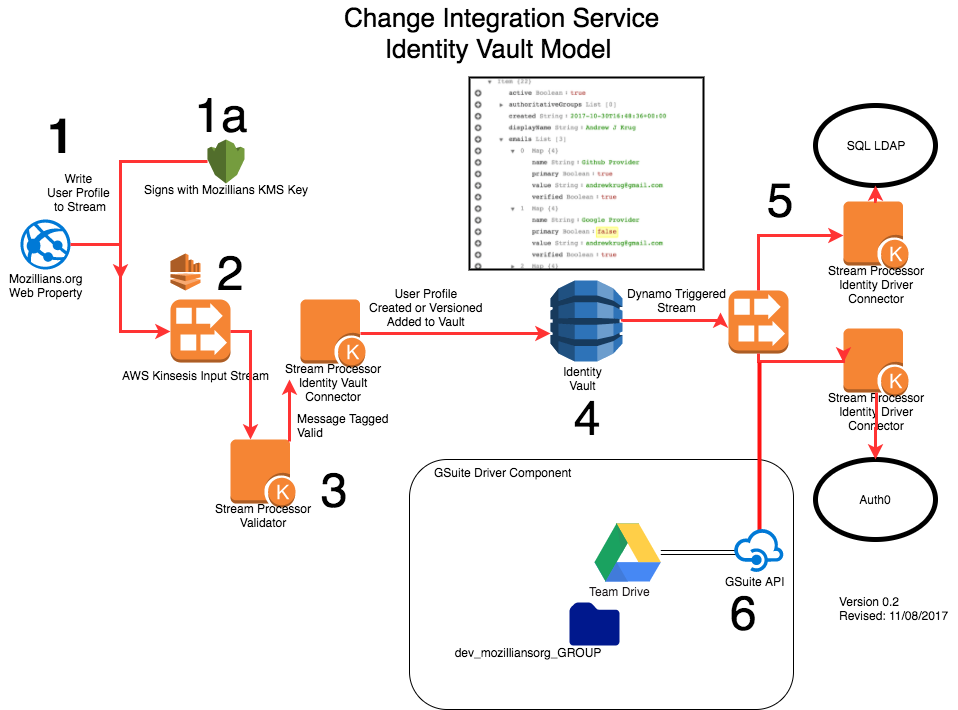

# G-Suite Community Drive Driver

## About
This driver was created for the Mozilla IAM Project to satisfy an OKR around community members accessing content
in GSuite.  

## Behavior

1. Spin up on cron/event trigger.
2. Scan the dynamodb table of all profiles.
3. Build a group data structure from all profiles.
4. Create a TeamDrive object from the library.
5. Opportunistically create team drive.
6. Reconcile the permissions list with the group membership based e-mail preferring Mozilla.org, then verified Google accounts.
7. Return a proposal per drive of add / remove / noops.
8. Execute the proposal for each set of ops.
9. Finish

## Process Diagram


## FAQ

__Q:__ Can a Mozilla Employee or Community Member delete the drive?
__A:__ No all members of the drive are equal, "writer" role. Only the drive owner can delete the drive.  In this case "iam-robot@mozilla.com" owns the drive object.

__Q:__ Will a leaked service account credential result in loss of data for our other team drives.

__A:__ While this is non-ideal the credential impersonation only has access to the scopes and data it's granted in the GSuite console.  This particular service account "iam robot" is in it's own sub-org and only has control of drives it creates.

__Q:__ How long does it take to get access?

__A:__ The connector runs in about 10-seconds for add/remove operations.

__Q:__ What happens if an admin messes up and adds people to the drive that don't belong.

__A:__ The event-trigger for the function runs every 10-minutes.  Any member that is not added via Mozillians.org will be removed.

## Deployment

__Sample Credstash Secret Insert of Service Account Token for SVC Actor Role__

```
credstash -r us-west-2 put -a gsuite-driver.token @/GSuite-Community-Driver-4ba74895df1f.json app=gsuite-driver
```

```
docker run --rm -ti \
-v ~/.aws:/root/.aws \
-v `pwd`:/workspace \
mozillaiam/docker-sls:latest \
/bin/bash

sls plugin install -n serverless-python-requirements

sls deploy --stage dev --region us-west-2
```
